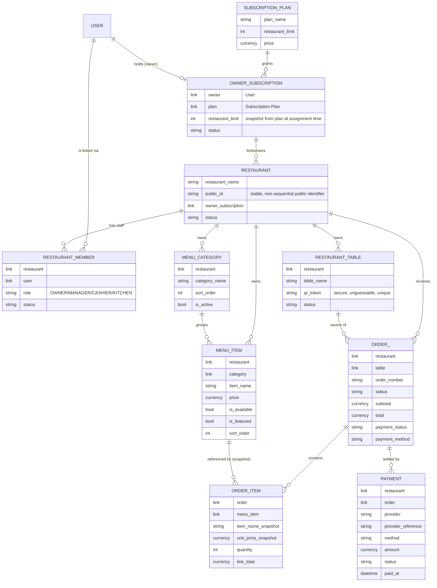

# Domain model

> **Status:** Slice 0 — none of these DocTypes exist yet. This is the planned shape,
> baselined from the product spec, to be implemented incrementally (noted per-entity
> below). Treat field lists as a starting point, not a frozen schema — each slice's
> implementation is the source of truth once it lands.

## Entity-relationship overview

(Entity/field names above are illustrative Doctype names; Frappe's actual DocType
names use Title Case with spaces, e.g. `Owner Subscription`, `Restaurant Member`. The
diagram uses `snake_case`/`ORDER_` only because Mermaid reserves the word `ORDER`.)

## Planned DocTypes and design notes

### Subscription Plan — *Slice 1*
Platform-defined (created/edited by System Manager only). `restaurant_limit` is the
single enforced constraint for v1; billing integration is deliberately out of scope
until a real provider is chosen (see architecture.md → Payments for the analogous
provider-neutral pattern this will likely follow).

### Owner Subscription — *Slice 1*
Links one `User` (the shop owner) to one `Subscription Plan`. Manually assigned by a
platform admin for v1 (no self-serve billing yet). `restaurant_limit` is **snapshotted**
onto the Owner Subscription at assignment time rather than always read live from the
Plan — so changing a Plan's limit later doesn't retroactively change limits for owners
already on a (possibly grandfathered) subscription, unless a platform admin explicitly
re-assigns. This is a deliberate business-rule decision, not an oversight; revisit if
plan changes should always be "live."

**Enforcement:** `Restaurant.validate()` (or a whitelisted `create_restaurant` API,
whichever proves simpler in Slice 1) counts the owner's current active restaurants
against `Owner Subscription.restaurant_limit` and raises `frappe.ValidationError`
server-side before insert — never relies on the UI disabling a button.

### Restaurant — *Slice 1*
The tenant boundary. Carries a `public_id` distinct from its Frappe `name` (autoname) —
a non-sequential, non-guessable identifier safe to expose in customer-facing QR URLs
(`/menu/<public_id>/<table_token>`), so internal document IDs are never exposed to the
public internet. Belongs to exactly one `Owner Subscription`.

### Restaurant Member — *Slice 2*
The join between `User` and `Restaurant`, carrying the **restaurant-level** role
(`OWNER` / `MANAGER` / `CASHIER` / `KITCHEN`) — distinct from Frappe's own system roles.
One user can have multiple `Restaurant Member` rows (different restaurants, different
roles). `status` (Active/Disabled) supports revoking access without deleting history.
This is the enforcement point described in `permissions.md`.

### Menu Category / Menu Item — *Slice 3*
Both restaurant-scoped. Category name unique **per restaurant** (not globally) via a
compound uniqueness check in `validate()` (Frappe's declarative `unique` field option is
global-only, so this needs an explicit query check). **Integrity rule enforced
server-side:** `Menu Item.validate()` rejects any item whose `category.restaurant !=
item.restaurant` — a menu item can never reference another restaurant's category.
Variants/add-ons are intentionally not modeled in v1; the schema doesn't need to
anticipate them beyond "don't do anything that would make adding them later a rewrite"
(e.g. don't hardcode a single flat price string anywhere outside `Menu Item.price`).

### Restaurant Table — *Slice 4*
`qr_token` is a separate, randomly-generated, unguessable string — **not** the Frappe
document `name`/internal ID. Deactivating a table (status → Inactive) rather than
deleting it preserves historical `Order` references (Frappe's link-field
`on_delete` behavior would otherwise either block deletion or null out history —
soft-deactivation avoids both problems and matches the product requirement directly).

### Order / Order Item — *Slice 6*
**Order Item will be a child table of Order**, not an independent top-level DocType.
Reasoning: order items have no independent lifecycle or identity outside their parent
order (they're never queried, listed, or permission-checked on their own), they're
always created/read/updated atomically with the order, and Frappe's child-table
mechanism already gives atomic parent+children saves for free — matching the spec's
"order creation should be atomic" requirement without extra transaction-management code.
This is the standard Frappe pattern for "detail lines" (cf. Sales Order Item, Purchase
Order Item in ERPNext) and avoids inventing bespoke transaction handling that Frappe
already solves.

Order Item snapshots `item_name_snapshot` and `unit_price_snapshot` at order time — the
live `Menu Item` is only ever the *reference*, never the source of truth for a placed
order's historical price/name. `line_total = unit_price_snapshot * quantity`, computed
server-side.

Order lifecycle is an explicit state machine (`PENDING → ACCEPTED → PREPARING → READY →
SERVED → COMPLETED`, plus terminal `REJECTED`/`CANCELLED`), implemented as named
controller methods (`accept()`, `start_preparing()`, `mark_ready()`, `mark_served()`,
`complete()`, `cancel()`) that each validate the current state before transitioning —
never a generic "PATCH status to anything" endpoint.

### Payment — *Slice 7 (manual) / Slice 8 (provider abstraction)*
Restaurant- and order-scoped. `provider` distinguishes `MANUAL` from named online
providers; `provider_reference` holds the gateway's own transaction id for online
payments. An order's `payment_status` only flips to paid once a `Payment` row reaches
`PAID` status — for online payments, that transition is driven by a server-verified
callback/webhook/reconciliation call, **never** by the customer's browser reaching a
"success" redirect page. See architecture.md → Payments for the abstraction boundary.

## Explicitly deferred / not modeled in v1

- Billing/subscription payment integration (Owner Subscription assignment is manual).
- Menu item variants and add-ons.
- Real online payment gateway integration (Slice 8 ships a mock/test provider only).
- `Restaurant Settings` as a separate DocType — not introduced until a concrete need
  for restaurant-level configuration beyond what fits on `Restaurant` itself appears
  (per the "don't add abstractions before the pattern exists" principle).
