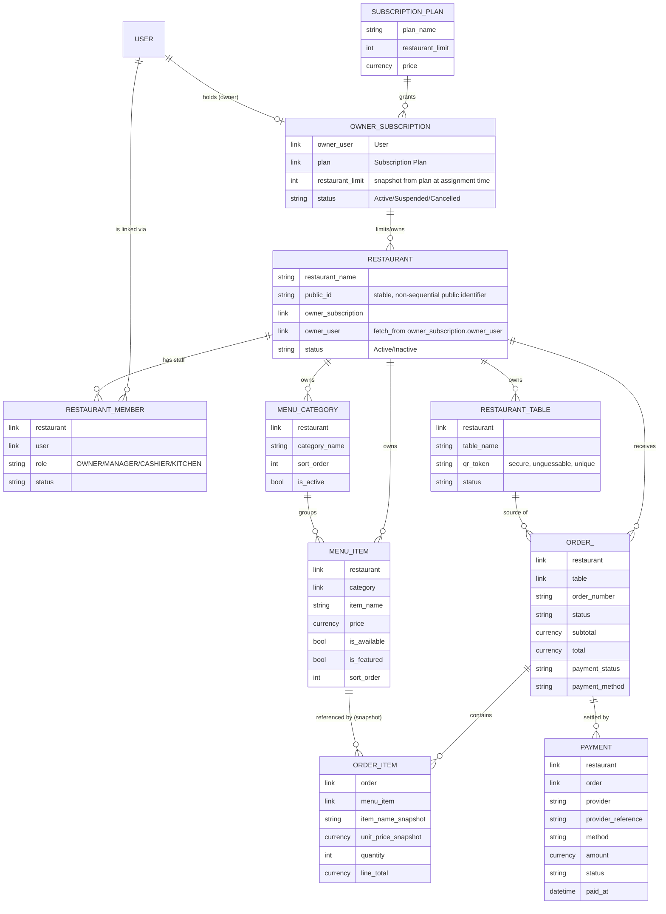

# Domain model

> **Status:** Slice 3 — `Subscription Plan`, `Owner Subscription`, `Restaurant`,
> `Restaurant Member`, `Menu Category`, and `Menu Item` are implemented (fields/behavior
> below reflect actual code, not just the plan). Everything else is still the planned
> shape baselined from the product spec, to be implemented incrementally (noted
> per-entity below) — treat those field lists as a starting point, not a frozen schema.

## Entity-relationship overview

(Entity/field names above are illustrative Doctype names; Frappe's actual DocType
names use Title Case with spaces, e.g. `Owner Subscription`, `Restaurant Member`. The
diagram uses `snake_case`/`ORDER_` only because Mermaid reserves the word `ORDER`.)

## Planned DocTypes and design notes

### Subscription Plan — *Slice 1, implemented*
Platform-defined (`System Manager` only — no permission row exists for any other role,
so this is a hard DocType-level restriction, not just a UI hint). Fields: `plan_name`
(autoname, unique), `restaurant_limit` (Int, non-negative), `is_active` (Check),
`description`. `restaurant_limit` is the single enforced constraint for v1; billing
integration is deliberately out of scope until a real provider is chosen (see
architecture.md → Payments for the analogous provider-neutral pattern this will likely
follow).

### Owner Subscription — *Slice 1, implemented*
Links one `User` (`owner_user` — named that, not `owner`, because `owner` is Frappe's
own built-in "created-by" audit field on every document) to one `Subscription Plan`.
Manually assigned by a platform admin for v1 (no self-serve billing yet — see
`permissions.md` for what "manually assigned" means for who can create one).
`restaurant_limit` is **snapshotted** onto the Owner Subscription when it's created or
when its `plan` link changes, rather than always read live from the Plan — so changing a
Plan's limit later doesn't retroactively change limits for owners already on a (possibly
grandfathered) subscription, and a platform admin can freely override the number for one
owner without it snapping back. `status` (`Active`/`Suspended`/`Cancelled`) — only one
`Active` subscription per `owner_user` is allowed at a time (enforced in `validate()`);
older subscriptions are kept as history rather than deleted. The owner must be a Frappe
`User` with `user_type = System User` (Desk access) — enforced in `validate()`, because
Frappe derives `user_type` from whether the user holds any `desk_access` role, so a user
with no relevant role would silently become a Website User regardless of what's set
directly on the field.

**Enforcement:** `Restaurant.validate()` locks the Owner Subscription row (`SELECT ...
FOR UPDATE`), counts the owner's current restaurants (all statuses — see below) against
`Owner Subscription.restaurant_limit`, and raises `frappe.ValidationError` server-side
before insert — verified via both `bench run-tests` and a live HTTP `POST
/api/resource/Restaurant` call, not just the Desk UI disabling a button.

### Restaurant — *Slice 1, implemented*
The tenant boundary. Fields: `restaurant_name`, `owner_subscription` (Link, required),
`owner_user` (Link, read-only, `fetch_from: owner_subscription.owner_user` — denormalized
so the permission query condition doesn't need a JOIN), `public_id` (Data, read-only,
unique, a 16-char random hash generated once in `validate()`), `status`
(`Active`/`Inactive`). `public_id` is distinct from the Frappe `name` (autoname
`REST-.#####`) — a non-sequential, non-guessable identifier safe to expose in
customer-facing QR URLs later (`/menu/<public_id>/<table_token>`, Slice 4+), so internal
sequential document IDs are never exposed to the public internet.

Two independent server-side checks run in `Restaurant.validate()`, both proven with
automated tests (`bench --site <site> run-tests --app e_menu`):
- **Ownership:** the acting user must be `owner_subscription.owner_user`, unless they're
  a platform admin (`System Manager`) — a client can't just supply someone else's
  `owner_subscription` and have it accepted.
- **Limit:** existing restaurants under that subscription (counted regardless of
  `status` — deactivating one is not a loophole to free up a slot, matching "prefer
  deactivation over deletion") must be below `restaurant_limit`.

### Restaurant Member — *Slice 2, implemented*
The join between `User` and `Restaurant`, carrying the **restaurant-level** role
(`OWNER` / `MANAGER` / `CASHIER` / `KITCHEN`) — distinct from Frappe's own system roles
(see `permissions.md` for the full distinction). Fields: `restaurant`, `user`, `role`
(Select), `status` (`Active`/`Disabled`). One `(restaurant, user)` pair may only have one
membership row ever (enforced in `validate()`) — reactivate/change the existing row
rather than inserting a new one; a user *can* have multiple rows across *different*
restaurants, each with an independent role.

Business rules, all in `RestaurantMember.validate()` and proven by automated tests:
- **Who can manage staff:** creating or editing a membership row requires the acting
  user to already be `OWNER` or `MANAGER` at that restaurant (or a platform admin) — see
  `permissions.md` for the one bootstrapping exception (a restaurant's very first OWNER
  row, created automatically).
- **At least one active OWNER:** disabling a membership, or changing its role away from
  `OWNER`, is rejected if it would leave the restaurant with zero active OWNERs.
- **Desk access is additive:** gaining any active membership grants the `Restaurant
  Staff` Frappe Role (`e_menu.e_menu.doctype.restaurant_member.restaurant_member.RestaurantMember.sync_frappe_role`);
  disabling one membership never revokes it, in case the user has Desk access via
  another active membership elsewhere.

`Restaurant.after_insert` automatically creates the restaurant's first `Restaurant
Member` row (`role=OWNER`, for `owner_subscription.owner_user`) — every restaurant has
at least one staff member (its creator) from the moment it exists. A one-time patch
(`e_menu/patches/v0_0/backfill_restaurant_owner_membership.py`) backfills this for
restaurants created in Slice 1, before this hook existed.

**`invite_staff(restaurant, email, role, first_name=None)`** (whitelisted, in
`restaurant_member.py`) is the owner/manager-facing "invite staff" action: creates the
`User` if the email doesn't exist yet, then the `Restaurant Member` row — the one
whitelisted business action for this slice, per the "don't over-engineer the first
version" guidance in the spec (no custom permission-type framework, just an explicit
server-side role check mirroring `validate_actor_can_manage_staff`).

**Restaurant access was extended in this slice** (`e_menu/permissions.py`): originally
(Slice 1) only `owner_subscription.owner_user` could read/write a `Restaurant`. Now any
active staff member can *read* it, and `OWNER`/`MANAGER` can also *write* it —
`CASHIER`/`KITCHEN` remain read-only on the `Restaurant` record itself (they still get
full read/write on whatever their role needs in later slices, e.g. orders).

### Menu Category / Menu Item — *Slice 3, implemented*
Both restaurant-scoped, fieldnames `category_name`/`item_name` (not `name` — Frappe's
own autoname field, same reason `owner_user` isn't called `owner`; see Slice 1).

**Menu Category:** `restaurant`, `category_name`, `description`, `image` (`Attach
Image` — native Frappe file upload, no custom file-handling code), `sort_order`,
`is_active`. Name unique **per restaurant** (not globally), via an explicit `validate()`
query check (Frappe's declarative `unique` field option is a global DB constraint, which
would incorrectly block Restaurant A and B from both having a "Drinks" category) —
MariaDB's `utf8mb4_unicode_ci` collation (see `development.md`) makes the comparison
case-insensitive for free.

**Menu Item:** `restaurant`, `category` (Link), `item_name`, `description`, `image`,
`price` (Currency, non-negative), `is_available`, `is_featured`, `sort_order`. **Core
integrity rule, enforced server-side in `MenuItem.validate()`:** a Menu Item's `category`
must belong to the *same* `restaurant` as the item itself — checked unconditionally
(even for a platform admin), because this is a data-integrity invariant, not an
authorization rule. Proven by automated tests and live over real HTTP
(`POST /api/resource/Menu Item` with a cross-restaurant `category` returns HTTP 417).
A matching client-side `frm.set_query()` filter on the `category` field (Desk UX only,
not a security control) keeps the picker showing only same-restaurant categories.

**Authorization** (`e_menu/permissions.py`, generalized into
`_restaurant_scoped_has_permission`/`_restaurant_scoped_query_conditions` since this is
now the third DocType with the same shape — see `Restaurant Member` above): any active
staff member of the restaurant can read; `OWNER`/`MANAGER` can also create/write/delete.
`CASHIER`/`KITCHEN` are read-only on the menu itself, matching `permissions.md`'s stated
role intent (they need to *see* prices/items, not edit them).

Variants/add-ons are intentionally not modeled in v1; the schema doesn't need to
anticipate them beyond "don't do anything that would make adding them later a rewrite"
(e.g. don't hardcode a single flat price string anywhere outside `Menu Item.price`).

### Restaurant Table — *Slice 4*
`qr_token` is a separate, randomly-generated, unguessable string — **not** the Frappe
document `name`/internal ID. Deactivating a table (status → Inactive) rather than
deleting it preserves historical `Order` references (Frappe's link-field
`on_delete` behavior would otherwise either block deletion or null out history —
soft-deactivation avoids both problems and matches the product requirement directly).

### Order / Order Item — *Slice 6*
**Order Item will be a child table of Order**, not an independent top-level DocType.
Reasoning: order items have no independent lifecycle or identity outside their parent
order (they're never queried, listed, or permission-checked on their own), they're
always created/read/updated atomically with the order, and Frappe's child-table
mechanism already gives atomic parent+children saves for free — matching the spec's
"order creation should be atomic" requirement without extra transaction-management code.
This is the standard Frappe pattern for "detail lines" (cf. Sales Order Item, Purchase
Order Item in ERPNext) and avoids inventing bespoke transaction handling that Frappe
already solves.

Order Item snapshots `item_name_snapshot` and `unit_price_snapshot` at order time — the
live `Menu Item` is only ever the *reference*, never the source of truth for a placed
order's historical price/name. `line_total = unit_price_snapshot * quantity`, computed
server-side.

Order lifecycle is an explicit state machine (`PENDING → ACCEPTED → PREPARING → READY →
SERVED → COMPLETED`, plus terminal `REJECTED`/`CANCELLED`), implemented as named
controller methods (`accept()`, `start_preparing()`, `mark_ready()`, `mark_served()`,
`complete()`, `cancel()`) that each validate the current state before transitioning —
never a generic "PATCH status to anything" endpoint.

### Payment — *Slice 7 (manual) / Slice 8 (provider abstraction)*
Restaurant- and order-scoped. `provider` distinguishes `MANUAL` from named online
providers; `provider_reference` holds the gateway's own transaction id for online
payments. An order's `payment_status` only flips to paid once a `Payment` row reaches
`PAID` status — for online payments, that transition is driven by a server-verified
callback/webhook/reconciliation call, **never** by the customer's browser reaching a
"success" redirect page. See architecture.md → Payments for the abstraction boundary.

## Explicitly deferred / not modeled in v1

- Billing/subscription payment integration (Owner Subscription assignment is manual).
- Menu item variants and add-ons.
- Real online payment gateway integration (Slice 8 ships a mock/test provider only).
- `Restaurant Settings` as a separate DocType — not introduced until a concrete need
  for restaurant-level configuration beyond what fits on `Restaurant` itself appears
  (per the "don't add abstractions before the pattern exists" principle).
